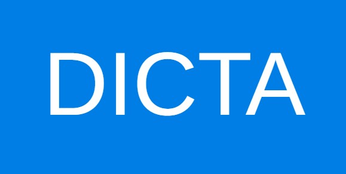

<!-- PROJECT SHIELDS -->
<!--
*** I'm using markdown "reference style" links for readability.
*** Reference links are enclosed in brackets [ ] instead of parentheses ( ).
*** See the bottom of this document for the declaration of the reference variables
*** for contributors-url, forks-url, etc. This is an optional, concise syntax you may use.
*** https://www.markdownguide.org/basic-syntax/#reference-style-links
-->
![Downloads][Github-downloads]
[![Contributors][contributors-shield]][contributors-url]
[![Forks][forks-shield]][forks-url]
[![Stargazers][stars-shield]][stars-url]
[![Issues][issues-shield]][issues-url]
[![Personal Use License][license-shield]][license-url]


<div dir="rtl">

<!-- PROJECT LOGO -->
<br />
<div align="center">
  <a href="https://github.com/otzaria/otzaria">
    
  </a>

  <h3 align="center">אוצריא</h3>

  <p align="center">
    הנגשת הספרייה היהודית לכל אחד, על ידי יצירת אפליקציה עם ממשק וחווית משתמש מודרניים שיכולה לרוץ על כל מכשיר
    <br />
    <a href="https://www.otzaria.org/"><strong>לאתר שלנו »</strong></a>
    <br />
    <br/>  
    <a href="https://github.com/otzaria/otzaria/issues/new?labels=bug&template=bug-report---.md">דיווח על באג</a>
    ·
    <a href="https://github.com/otzaria/otzaria/issues/new?labels=enhancement&template=feature-request---.md">בקשת תכונה</a>
  </p>
</div>


<!-- TABLE OF CONTENTS -->
---

## תוכן עניינים
1. [אודות הפרויקט](#about-the-project)
   - [נבנה באמצעות](#built-with)
2. [תחילת העבודה](#getting-started)
   - [דרישות מקדימות](#prerequisites)
   - [התקנה](#installation)
3. [מפת דרכים](#roadmap)
4. [תרומה לפרויקט](#contributing)
5. [רישיון](#license)
6. [יצירת קשר](#contact)
7. [תודות](#acknowledgments)

---


<!-- ABOUT THE PROJECT -->
## אודות הפרויקט

הרגשתי בחסרונה של אפליקציה בקוד פתוח לספרייה היהודית, עבור מחשבים.


תורת אמת היא ישנה ואינה מתוחזקת עוד, והאפליקציה של ספריא נהדרת, אך היא אינה עובדת היטב על מחשבים.

לכן החלטתי לבנות אחת בעצמי. בהתחלה לא הכרתי כלל את Dart ו-Flutter, אבל זה היה כיף. אני **אוהב** ללמוד טכנולוגיות חדשות!

מסד הנתונים עצמו נגיש לכולם בעקבות עבודתם החשובה של ארגון ספריא, אז תודה גדולה להם על כך.

תכונות עיקריות של הפרויקט:
* התוכנה היא חינמית ותישאר חינמית לעד.
* נבנתה לעבוד ביעילות על כל מכשיר, כולל Windows, Linux ו-Android.
* האפליקציה תוכננה להיות ידידותית למשתמש ככל האפשר.
* נעשה תהליך בחירה קפדני כדי להבטיח שהספרים מתאימים לציבור התורני.
* הספרייה גמישה, כלומר ניתן להוסיף או להסיר ספרים מהספרייה.
* מנוע חיפוש מהיר, כולל ספרים שהמשתמש הוסיף.
* האפליקציה תומכת בפורמטים הבאים: TXT, Docx ו-PDF.

אני מקווה שעבודתי תסייע לציבור התורני ללמוד בקלות וביעילות בכל זמן ובכל מקום.

([⇧](#readme-top))

### נבנה באמצעות


* [![Dart][dart]][Dart-url]
* [![Flutter][Flutter]][Flutter-url]

בחרתי להשתמש ב-Dart וב-Flutter. אני חושב שזו הדרך היעילה והמודרנית ביותר לבנות אפליקציה עם ממשק גרפי.

בנוסף, זוהי מסגרת רב-פלטפורמית.

([⇧](#readme-top))


<!-- GETTING STARTED -->
## תחילת העבודה

### Windows
#### התקנה

**בחרו את קובץ ההתקנה שלכם:**

1. **התקנה מלאה (מומלץ)** - `otzaria-x.x.x-windows-full.exe`
   - כולל את כל התלויות הנדרשות (Visual C++ Redistributable)
   - מתקין אוטומטית רכיבים חסרים
   - הבחירה הטובה ביותר לרוב המשתמשים
   - גודל הורדה גדול יותר (כ-100MB יותר)

2. **התקנה רגילה** - `otzaria-x.x.x-windows.exe`
   - גודל הורדה קטן יותר
   - דורש ש-Visual C++ Redistributable יהיה מותקן מראש
   - עבור משתמשים שיודעים שכבר יש להם את התלויות הנדרשות

הורידו את הגרסה האחרונה ל-Windows מ-[releases](https://github.com/otzaria/otzaria/releases).

* לחלופין, ניתן להתקין את האפליקציה דרך [חנות Microsoft](https://apps.microsoft.com/detail/9nm0qmkc10nn).

**הערה:** הספרייה כלולה בקובץ ה-.exe.
במקרה שאתם זקוקים רק לאפליקציה עצמה לצורך שדרוג, הורידו את גרסת ה-ZIP ל-Windows מ-releases.

#### דרישות מקדימות (להתקנה הרגילה בלבד)
אם אתם משתמשים בהתקנה הרגילה, ודאו ש-Visual C++ Redistributable מותקן במחשב שלכם. אם לא, הורידו אותו מ-[כאן](https://learn.microsoft.com/en-us/cpp/windows/latest-supported-vc-redist?view=msvc-170) והתקינו אותו.

### Linux
#### דרישות מקדימות
```sudo apt-get install libgtk-3-0 libblkid1 liblzma5```
#### התקנה
* הורידו את גרסת Linux מ-releases, חלצו והריצו את Otzaria.
* עבור גרסאות רשמיות קיים גם חבילה מלאה (FULL): `otzaria-linux-full.tar.zst`.
* החבילה המלאה כוללת את האפליקציה והספרייה יחד. חלצו אותה (`tar --zstd -xf otzaria-linux-full.tar.zst`) והריצו את `run-otzaria.sh`.
* בהרצה הראשונה של האפליקציה, תתבקשו להוריד את הספרייה.
* לחלופין, ניתן להוריד את הספרייה ידנית מ-[כאן](https://github.com/Otzaria/SeforimLibrary/releases), לחלץ אותה ולספק את הנתיב שלה לאפליקציה.

### Android
* האפליקציה זמינה ב-Google Play: [קישור](https://play.google.com/store/apps/details?id=org.otzaria.otzaria)
* לחלופין, ניתן להוריד את קובץ ה-.apk מדף ה-releases ולהתקין אותו.
* עבור גרסאות רשמיות קיים גם חבילה מלאה (FULL): `otzaria-android-full.zip`.
* החבילה המלאה ל-Android כוללת את ה-APK יחד עם תוכן הספרייה הלא-מקוון להפצה.
* בהרצה הראשונה של האפליקציה, תתבקשו להוריד את הספרייה.
* לחלופין, ניתן להוריד את הספרייה ידנית מ-[כאן](https://github.com/Otzaria/SeforimLibrary/releases) ולספק את קובץ ה-zip לאפליקציה.

### iOS (אייפון/אייפד)
* האפליקציה זמינה ב-AppStore: [קישור](https://apps.apple.com/us/app/otzaria/id6738098031)
* בהרצה הראשונה של האפליקציה, תתבקשו להוריד את הספרייה.

### macOS
* הורידו את גרסת MacOS האחרונה מדף ה-releases.
* עבור גרסאות רשמיות קיים גם חבילה מלאה (FULL): `otzaria-macos-full.tar.zst`.
* החבילה המלאה כוללת את האפליקציה והספרייה יחד. חלצו אותה בטרמינל (`tar --zstd -xf otzaria-macos-full.tar.zst`; אם חסר zstd: `brew install zstd`) והפעילו את `Run Otzaria.command`.
* הריצו את האפליקציה תוך לחיצה על מקש ctrl.
* בהרצה הראשונה של האפליקציה, תתבקשו להוריד את הספרייה.
* לחלופין, ניתן להוריד את הספרייה ידנית מ-[כאן](https://github.com/Otzaria/SeforimLibrary/releases), לחלץ אותה ולספק את הנתיב שלה לאפליקציה.


([⇧](#readme-top))


<!-- ROADMAP -->
## מפת דרכים

- [x] הוספת שכבת לוגיקה עסקית על ידי החלפת ספריית ניהול המצב ל-Bloc.
- [x] העברת נתוני הספרים מקובצי טקסט למסד נתונים SQLite
- [ ] הוספת אפשרות לחיפוש סמנטי באמצעות מודל ML להטמעות (embedding) ומסד נתונים 

ראו את [הבעיות הפתוחות](https://github.com/otzaria/otzaria/issues) לרשימה מלאה של תכונות מוצעות (ובעיות ידועות).

([⇧](#readme-top))


<!-- CONTRIBUTING -->
## תרומה לפרויקט

תרומות הן מה שהופך את קהילת הקוד הפתוח למקום כה מדהים ללמוד, לתת השראה וליצור. כל תרומה שתתרמו **מוערכת מאוד**.

אם יש לכם הצעה שתשפר את הפרויקט, אנא בצעו fork למאגר וצרו pull request. ניתן גם פשוט לפתוח issue עם התגית "enhancement".
אל תשכחו לתת לפרויקט כוכב! תודה שוב!

1. בצעו Fork לפרויקט
2. צרו ענף תכונה משלכם (`git checkout -b feature/AmazingFeature`)
3. בצעו Commit לשינויים שלכם (`git commit -m 'Add some AmazingFeature'`)
4. בצעו Push לענף (`git push origin feature/AmazingFeature`)
5. פתחו Pull Request

### תנאי תרומה (חובה לקריאה)

בעצם פתיחת Pull Request, שליחת קוד, או עריכת תוכן קיים במאגר, התורם מסכים לתנאים הבאים — אלא אם צוין במפורש אחרת בכתב בעת מסירת התרומה:

* **העברת זכויות והסכמה לרישוי:** התורם מעביר לבעל הפרויקט (Otzaria Project) את מלוא זכויות היוצרים והקניין בתרומתו, או — לכל הפחות — מעניק רישיון בלעדי, עולמי, בלתי חוזר, ללא תמלוגים ועם זכות רישוי-מחדש, להשתמש בתרומה, לשנותה, להפיצה ולרשותה תחת כל רישיון, לרבות [Personal Use License](LICENSE) ורישיונות עתידיים.
* **ויתור על תביעות:** התורם מוותר על כל דרישה, תמלוג או תביעה בגין השימוש בתרומתו במסגרת הפרויקט או מיזמים נלווים לו.
* **הצהרת בעלות:** התורם מצהיר שהתרומה היא יצירה מקורית שלו ושהוא רשאי להעניק בה את הזכויות הללו, ושאינה מפרה זכויות של צד שלישי.
* **שמירת קרדיט:** מתן הקרדיט לתורם (ברשימת התורמים / היסטוריית הגיט) נשמר; אין באמור כדי לגרוע מזכותו המוסרית להיות מוכר כיוצר התרומה.

תרומה שאינה עומדת בתנאים אלו לא תיקלט במאגר.

### מפתחות בנייה מקומיים

חלק מהנתונים בתוכנה (כרגע נתוני הביוגרפיות) מקודדים במפתח שאינו נשמר בקוד המקור.
ב-CI המפתח מוזרק מסוד; בפיתוח מקומי מעתיקים פעם אחת את קובץ הדוגמה ומזינים את הערך:

```bash
cp dart_defines.example.json dart_defines.local.json
```

הקובץ `dart_defines.local.json` מוחרג מגיט. אחר כך מריצים כך:

```bash
flutter run --dart-define-from-file=dart_defines.local.json
```

ב-VS Code אין צורך בדגל — תצורת ההרצה `.vscode/launch.json` שבריפו כבר כוללת אותו (F5).
בלי המפתח התוכנה עולה כרגיל, ורק אזור הביוגרפיות יציג שאין נתונים.

([⇧](#readme-top))

### פתרון בעיות בבנייה (Build)

**שגיאת תעודת SSL ברשתות מסוננות (NetFree וכדומה)**

אם אתם נתקלים בשגיאת תעודת SSL בעת בנייה ל-Windows (למשל `status_code: 60`, `CERT_TRUST_REVOCATION_STATUS_UNKNOWN`), סביר להניח שהדבר נובע מסינון רשת.

לפתרון מפורט שלב-אחר-שלב, אנא עיינו ב-**[ויקי NetFree - מדריך הגדרת Flutter](https://netfree.link/wiki/%D7%94%D7%AA%D7%A7%D7%A0%D7%AA_%D7%AA%D7%A2%D7%95%D7%93%D7%94_%D7%A2%D7%91%D7%95%D7%A8_%D7%A1%D7%91%D7%99%D7%91%D7%AA_Flutter#windows)**.

**פתרון מהיר (PowerShell):**
אם אתם זקוקים לעקיפה מהירה לפני הבנייה, הריצו:
```powershell
$env:CMAKE_TLS_VERIFY="0"
flutter build windows
```

([⇧](#readme-top))


<!-- LICENSE -->
## רישיון

הקוד המקורי של הפרויקט מופץ תחת:

**Personal Use License 1.0 — שימוש אישי בלבד**

[פירוט מלא ברישיון](LICENSE)

**תנאי הרישיון בקצרה:**
- מותר שימוש אישי ופרטי בלבד של אדם פרטי (הורדה, הרצה, לימוד ושינוי לצורך עצמי)
- אסור כל שימוש ציבורי — בין מסחרי ובין במסגרת תוכנה חינמית/קוד פתוח — ללא רשות מפורשת בכתב
- אסורה כל הפצה, פרסום, או שילוב במוצר/שירות/אתר/API
- אסור שימוש של חברה, עמותה, מוסד או כל גוף שהוא ללא רשות מפורשת בכתב
- חובת מתן קרדיט ל'אוצריא' נשמרת גם לאחר קבלת רשות
- לבקשת רשות: otzaria.1@gmail.com

> **הערת מעבר:** גרסאות של התוכנה שפורסמו לפני כניסת רישיון זה לתוקף היו תחת GPL-3.0, וזכויות שכבר ניתנו תחתיו אינן מבוטלות. רישיון זה חל על הגרסה הנוכחית ואילך, ובכפוף לזכויות של תורמים אחרים בקוד. רישיון זה חל **רק על הקוד המקורי שלנו** — רכיבי צד שלישי (ספריות, חבילות, גופנים ונכסים) נשארים תחת רישיונותיהם המקוריים, וכך גם הטקסטים והספרים המופצים בנפרד.

([⇧](#readme-top))


<!-- CONTACT -->
## יצירת קשר

תמיכה: otzaria.1@gmail.com

קישור לפרויקט: [https://github.com/otzaria/otzaria](https://github.com/otzaria/otzaria)

([⇧](#readme-top))


<!-- ACKNOWLEDGMENTS -->
## תודות

תוכנה זו נוצרה והוקדשה על ידי:
[sivan22](https://github.com/Sivan22),
[ר. נבון (השקעה עצומה במעבר ל-SQLite)](https://github.com/rachelGrayover),
[Y.PL.](https://github.com/Y-PLONI),
[palmoni](https://github.com/palmoni5),
[YOSEFTT](https://github.com/YOSEFTT),
[zevisvei](https://github.com/zevisvei),
[evel-avalim](https://github.com/evel-avalim),
[userbot](https://github.com/userbot000),
[mosh-dvd](https://github.com/mosh-dvd),
[asz](https://github.com/DeveShlomo),
[michaelush](https://github.com/mmichaelush),
[NHLOCAL (פיתוח "שמור וזכור")](https://github.com/NHLOCAL/Shamor-Zachor).

תודה מיוחדת ל-**[אליהו גמבש](https://github.com/kdroidFilter)** על העבודה העצומה בהמרת נתוני ספריא ל-SQLite.

הפרויקט התאפשר בזכות הפרויקט המדהים של ספריא.
<br>
ובזכות עמותת דיקטה, שבאמצעותה נוספו ספרים חשובים רבים.
<br>
<br>
<a href="https://www.sefaria.org/texts" title="ספריא" target="_blank"></a>
<a href="https://github.com/Dicta-Israel-Center-for-Text-Analysis/Dicta-Library-Download" title="דיקטה" target="_blank"></a>
<a href="https://github.com/MosheWagner/Orayta-Books" title="אורייתא" target="_blank"></a>
<a href="http://mobile.tora.ws" title="ובלכתך בדרך" target="_blank"></a>
<a href="http://www.toratemetfreeware.com/index.html?downloads;1;" title="תורת אמת" target="_blank"></a>
<a href="https://wiki.jewishbooks.org.il/mediawiki/wiki/%D7%A2%D7%9E%D7%95%D7%93_%D7%A8%D7%90%D7%A9%D7%99" title="אוצר הספרים היהודי" target="_blank"></a>
<a href="https://he.wikisource.org/wiki" title="ויקיטקסט" target="_blank"></a>
<a href="https://pninim.org/" title="פנינים" target="_blank"></a>
<a href="https://www.nli.org.il/" title="הספרייה הלאומית" target="_blank"></a>
<a href="https://fjms.genizah.org/" title="פרויקט פרידברג" target="_blank"></a>
<!-- <a href="https://github.com/projectbenyehuda/public_domain_dump" title="פרוייקט בן יהודה" target="_blank"></a> -->

מציג ה-PDF מופעל באמצעות [pdfrx](https://pub.dev/packages/pdfrx).

עבור עדכונים אוטומטיים, השתמשתי ב-[updat](https://pub.dev/packages/updat).

Sefaria book conversion, the fuzzy search, and the library updates are powered by the technologies that drive Zayit — https://zayitapp.com/ (licensed under GNU AGPL v3).

([⇧](#readme-top))

</div>

<!-- MARKDOWN LINKS & IMAGES -->
<!-- https://www.markdownguide.org/basic-syntax/#reference-style-links -->
[contributors-shield]: https://img.shields.io/github/contributors/otzaria/otzaria.svg?style=for-the-badge
[contributors-url]: https://github.com/otzaria/otzaria/graphs/contributors
[forks-shield]: https://img.shields.io/github/forks/otzaria/otzaria.svg?style=for-the-badge
[forks-url]: https://github.com/otzaria/otzaria/network/members
[stars-shield]: https://img.shields.io/github/stars/otzaria/otzaria.svg?style=for-the-badge
[stars-url]: https://github.com/otzaria/otzaria/stargazers
[issues-shield]: https://img.shields.io/github/issues/otzaria/otzaria.svg?style=for-the-badge
[issues-url]: https://github.com/otzaria/otzaria/issues
[Github-downloads]: https://img.shields.io/github/downloads/otzaria/otzaria/total.svg?style=for-the-badge
[license-shield]: https://img.shields.io/github/license/otzaria/otzaria.svg?style=for-the-badge
[license-url]: https://github.com/otzaria/otzaria/blob/main/LICENSE
[dart]: https://img.shields.io/badge/dart-000000?style=for-the-badge&logo=dart&logoColor=61DAFB
[Dart-url]: https://dart.dev/
[Flutter]: https://img.shields.io/badge/Flutter-20232A?style=for-the-badge&logo=flutter&logoColor=61DAFB
[Flutter-url]: https://flutter.dev/
